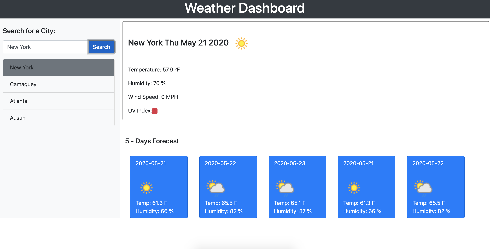
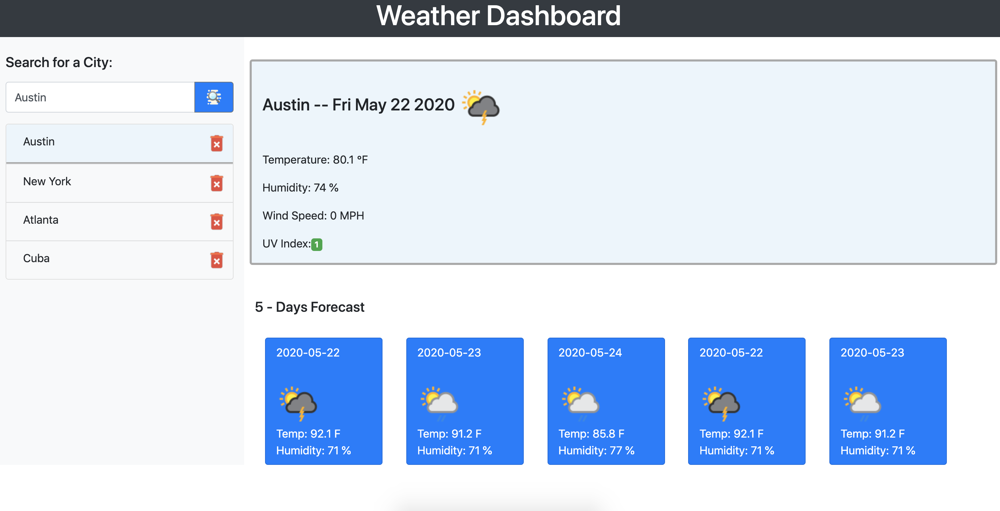

# Weather Dashboard

`This project hosts the source code for a Weather Dashboard. Display the weather of the city select by the user and the forecast days weather condition.`

## User Story

```
AS A traveler
I WANT to see the weather outlook for multiple cities
SO THAT I can plan a trip accordingly
```

### The following images demonstrates the application functionality:




## Installing / Getting Started

To test this project, simply clone project into a your local file system and open `index.html` in your favorite browser.

```
git clone https://github.com/ystamaritq/weather-dashboard.git
cd weather-dashboard
open index.html

```

---

### Initial Configuration

No additional setup required.

## Developing

Below is a summary of the key files for this project and their purpose:

- **index.html** weather dashboard html page
- **assets** folder that contains all files
- **assets/js/script.js** javascript files
- **assets/imgs/..** images used by the page
- **assets/css/style.css** main site custom stylesheet

## Additional Libraries:

- **Bootstrap**

## Features

In this weather dashboard once you click the search button you will have to enter a valid city name. And then you will be presented with all the weather information about the city.

## Licensing

"The code in this project is licensed under MIT license."

---

**developed with love by **@ystamaritq\*\*\*\*
